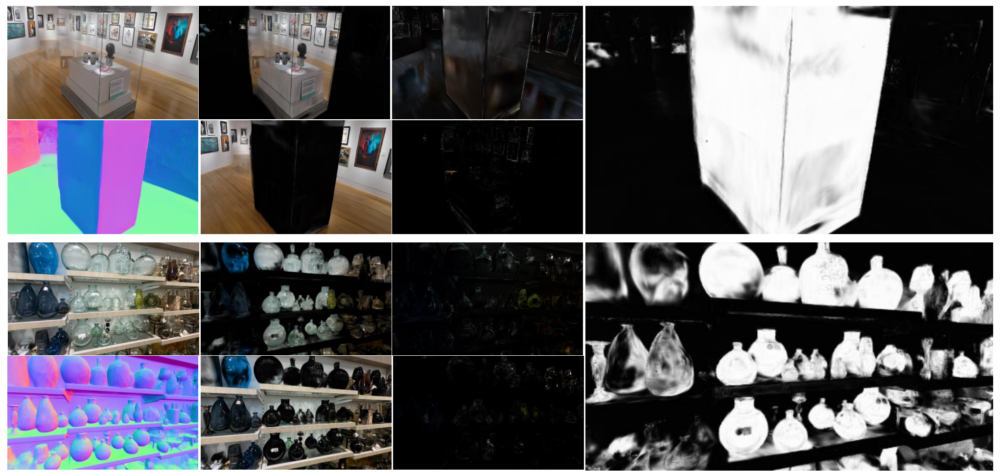

<div align="center">

# GLINT: Layered Gaussian Splatting for Scene-scale Transparency Modeling

[**Youngju Na**](https://youngju-na.github.io/)<sup>1,2</sup>, [**Jaeseong Yun**](jaeseong.yun@naverlabs.com)<sup>2</sup>, [**Soohyun Ryu**](soohyun.ryu@naverlabs.com)<sup>2</sup>, [**Hyunsu Kim**](hyunsu.xr@naverlabs.com)<sup>2</sup>, [**Sung-Eui Yoon***](https://scholar.google.com/citations?user=uLQzQW4AAAAJ&hl=en)<sup>1</sup>, and [**Suyong Yeon***](suyong.yeon@naverlabs.com)<sup>2</sup>

<br>

**Affiliations:**  
<p align="center">
    <span style="position: relative; display: inline-block;">
        <sup style="position: absolute; top: -5px; left: -10px; font-size: 12px;">1</sup>
        
    </span>
    &nbsp;&nbsp;
    <span style="position: relative; display: inline-block;">
        <sup style="position: absolute; top: -5px; left: -10px; font-size: 12px;">2</sup>
        
    </span>
</p>




<div align="left">

***News***:

- 25.10.02: :tada: commit initial code.


## Installation

This repository is built on top of [***EasyVolcap***](https://github.com/zju3dv/EasyVolcap), and [**EnvGS**](https://github.com/zju3dv/EnvGS) you can follow the instructions below for the basic installation of ***EasyVolcap***, these instructions are well-tested and should work on most systems.

```shell
# Create a new conda environment
conda create -n glint "python=3.11" -y
conda activate glint

# Install PyTorch
# Be sure you have CUDA installed, CUDA 11.8 is recommended for the best performance
# NOTE: you need to make sure the CUDA version used to compile the torch is the same as the version you installed
# NOTE: for avoiding any mismatch when installing other dependencies like Pytorch3D
pip install torch==2.3.1 torchvision==0.18.1 torchaudio==2.3.1 --index-url https://download.pytorch.org/whl/cu118  # change the CUDA version according to your own CUDA version

# Install basic pip dependencies
cat requirements.txt | sed -e '/^\s*-.*$/d' -e '/^\s*#.*$/d' -e '/^\s*$/d' | awk '{split($0, a, "#"); if (length(a) > 1) print a[1]; else print $0;}' | awk '{split($0, a, "@"); if (length(a) > 1) print a[2]; else print $0;}' | xargs -n 1 pip install
# Install development pip dependencies
cat requirements-dev.txt | sed -e '/^\s*-.*$/d' -e '/^\s*#.*$/d' -e '/^\s*$/d' | awk '{split($0, a, "#"); if (length(a) > 1) print a[1]; else print $0;}' | awk '{split($0, a, "@"); if (length(a) > 1) print a[2]; else print $0;}' | xargs -n 1 pip install # use this for full dependencies

# Register EasyVolcp for imports
pip install -e . --no-build-isolation --no-deps
```

```shell
# Clone the submodules
git submodule update --init --recursive

# Install the 2D Gaussian Tracer
pip install -v submodules/diff-surfel-tracing  # use `-v` for verbose output

# Install the modified 2D Gaussian rasterizers
pip install submodules/diff-surfel-rasterizations/diff-surfel-rasterization-wet submodules/diff-surfel-rasterizations/diff-surfel-rasterization-wet-ch05 submodules/diff-surfel-rasterizations/diff-surfel-rasterization-wet-ch07
```


## Datasets

In this section, we provide instructions on downloading the full dataset for our GLINT evaluation. We use selected scenes from *DL3DV-10K* that contain strong reflective and transmission properties based on manual annotations, and additionally provide our synthetic *3D-FRONT-T* dataset. You can download our pre-processed ***EasyVolcap*** format datasets via SSD or in this [Google Drive link]().

***GLINT*** follows the typical dataset setup of ***EasyVolcap***, where we group similar sequences into sub-directories of a particular dataset. Inside those sequences, the directory structure should generally remain the same. For example, after downloading and preparing a scene from the *DL3DV-10K* dataset, the directory structure should look like this:

```shell
# data/datasets/ref_real/sedan:
images # raw images, cameras inside: images/00, images/01 ...
sparse # SfM sparse reconstruction result copied from the original COLMAP format dataset
extri.yml # extrinsic camera parameters, not required if the optimized folder is present
intri.yml # intrinsic camera parameters, not required if the optimized folder is present
# optional, if no normals are provided, set `dataloader_cfg.dataset_cfg.use_normals=False`
diffrens # prepared diffusion-renderer channels (diffuse-albedo, normals, depths, etc.), cameras inside: normals/00, normals/01 ...
```

### Custom Datasets
If you want to prepare the datasets by yourself, you can use the following scripts to convert the original ***COLMAP*** dataset to the ***EasyVolcap*** format, taking the *DL3DV (ref-dl3dv)* dataset as an example:

- Note: setup diffusion-renderer environment following the original [diffusion-renderer](https://github.com/nv-tlabs/diffusion-renderer) repo before running the last commands. (it requires >24GB depending on the frame size. (adjust accordingly))

```shell
# Convert the original Ref-NeRF dataset from COLMAP format to EasyVolcap format
python scripts/preprocess/colmap_to_easyvolcap.py --data_root data/datasets/original/ref-dl3dv --output data/datasets/ref-dl3dv

# Run the diffusion-renderer to obtain video diffusion relighting priors 
python submodules/diffusion-renderer/run_inference_all_in_one.sh
```

Note that the above command will convert all scenes in the dataset, if you only want to convert a or a few specific scenes, you can specify by setting the `--scenes` parameter (e.g., `--scenes sedan` or `--scenes sedan gardenspheres`).

We have provided the dataset configurations for the *Ref-NeRF* and *NeRF-Casting* datasets in the [`configs/datasets/ref_real`](configs/datasets/ref_real) and [`configs/datasets/nerf-casting`](configs/datasets/nerf-casting) directories, and their corresponding training configurations in the [`configs/exps/envgs/ref_real`](configs/exps/envgs/ref_real) and [`configs/exps/envgs/nerf-casting`](configs/exps/envgs/nerf-casting) directories.

## Usage

### Rendering

You can download our pre-trained models from this [Google Drive link](). After downloading, place them into `data/trained_model`.


### Naming convention from EnvGS
Here we provide their naming conventions, which correspond to their respective config files:

+ `envgs/envgs/envgs_audi` (without any postfixes) is the EnvGS model trained on `audi` scene of the *EnvGS* dataset, corresponds to the experiment config [`configs/exps/envgs/envgs/envgs_audi.yaml`](configs/exps/envgs/envgs/envgs_audi.yaml).
+ `envgs/ref_real/envgs_spheres` (without any postfixes) is the EnvGS model trained on `gardenspheres` scene of the *Ref-Real* dataset, corresponds to the experiment config [`configs/exps/envgs/ref_real/envgs_spheres.yaml`](configs/exps/envgs/ref_real/envgs_spheres.yaml).

After placing the models and datasets in their respective places, you can run ***EasyVolcap*** with their corresponding experiment configs located in [`configs/exps/envgs`](configs/exps/envgs) to perform rendering operations with ***EnvGS***.


For example, to render the `audi` scene of the *EnvGS* dataset, you can run:

```shell
# Testing with input views and evaluating metrics
evc-test -c configs/exps/glint/ref-dl3dv/6b42314a2f8a18a193826e2b58e45729453e74524078283f740b8f8d330c3d2f.yaml exp_name=glint/ref-dl3dv/run-debug-change-expname/6b42314a2f8a18a193826e2b58e45729453e74524078283f740b8f8d330c3d2f

# test 3D-FRONT-T datasets
evc-test -c configs/exps/glint/manual_synthetic_GT_cam/scene_4.yaml exp_name=glint/manual_synthetic_GT_cam/0930-manual-synthetic/scene_4

# GUI Rendering
evc-gui -c configs/exps/glint/manual_synthetic_GT_cam/scene_4.yaml viewer_cfg.window_size=540,960
```

### Training

If you want to train the model on the provided datasets or custom datasets yourself. First, you need to prepare the dataset, check [Datasets Section](#datasets).

Once the dataset is prepared, you can start training the model. The training configurations are provided in the [`configs/exps/`](configs/exps/) directory.

We provide some examples below:

```shell
# Train ref-dl3dv
evc-train -c configs/exps/glint/ref-dl3dv/6b42314a2f8a18a193826e2b58e45729453e74524078283f740b8f8d330c3d2f.yaml exp_name=glint/ref-dl3dv/run-debug-change-expname/6b42314a2f8a18a193826e2b58e45729453e74524078283f740b8f8d330c3d2f

# Train 3D-FRONT-T datasets
evc-train -c configs/exps/glint/manual_synthetic_GT_cam/scene_4.yaml exp_name=glint/manual_synthetic_GT_cam/0930-manual-synthetic/scene_4

# Run all scenes of dl3dv:
./scripts_commands/run_all.sh

# Run all scenes of synthetic datasets:
./scripts_commands/run_all_synthetic.sh
```


<details> <summary> Some useful parameters you can explore with, good luck with them </summary>

+ `runner_cfg.resume`: whether to restart the training from where you stopped the last time.
+ `runner_cfg.epochs`: number of epochs to train, a epoch consist 500 iterations by default.
+ `model_cfg.supervisor_cfg.perc_loss_weight=0.01`: the default LPIPS loss weight is set to 0.01, you can try setting it to 0.1, which may produce better results for some scenes, or you can disable it by setting it to 0.0 for faster training, and comparable results.
+ `model_cfg.sampler_cfg.init_specular=0.001`: you can try to set it to a larger value like 0.01 or 0.1 for scenes or objects with strong reflection for better results.
+ `model_cfg.sampler_cfg.env_max_gs=2000000`: set the maximum number of environment Gaussian.
+ `model_cfg.sampler_cfg.normal_prop_until_iter=18000`: maximum iteration that normal propagation is performed.
+ `model_cfg.sampler_cfg.color_sabotage_until_iter=18000`: maximum iteration that color sabotage is performed.
+ `model_cfg.sampler_cfg.densify_until_iter=21000`: maximum densification iteration for the base Gaussian.
+ `model_cfg.sampler_cfg.env_densify_until_iter=21000`: maximum desification iteration for the environment Gaussian.

</details>


## Custom Datasets

### Dataset Preparation

In the following, we'll be walking throught the process of training on a custom multi-view dataset.

Let's call the dataset `ref-dl3dv` and call the scene `6b42...` for notation. Note that you can change out the `ref-dl3dv` and `6b42...` parts for other names for your custom dataset. Other namings like *envgs* should remain the same.

Let's assume a typical input contains calibrated camera parameters compatible with [***EasyVolcap***](https://github.com/zju3dv/EasyVolcap), where the folder & directory structure looks like this:

```shell
data/ref-dl3dv/6b42314a2f8a18a193826e2b58e45729453e74524078283f740b8f8d330c3d2f
│── extri.yml
│── intri.yml
├── images
│   ├── 0000
│   │   ├── 000000.jpg
│   │   ├── 000001.jpg
│   │   ...
│   │   ...
│   └── 0001
│   ...
└── diffren (priors from diffusion renderer)
    ├── normals   
    │   ├── 0000
    │   │   ├── 000000.jpg
    │   │   ...
    │   │   ...
    │   └── 0001
    ...
    ├── depths  
    │   ├── 0000
    │   │   ├── 000000.jpg
    │   │   ...
    │   │   ...
    │   └── 0001
```

We follow the dataset is prepared as the [***EasyVolcap***](https://github.com/zju3dv/EasyVolcap) format. If not, you could follow the instructions below (Code from EnvGS):

```shell
# Define the dataset name and scene name
dataset=ref-dl3dv
scene=6b42314a2f8a18a193826e2b58e45729453e74524078283f740b8f8d330c3d2f
colmap_root=data/datasets/original/$dataset
easyvolcap_root=data/datasets/$dataset

# 1. Run ffmpeg: if you start with a video at `data/datasets/original/envgs/audi/video.mp4`
# 1.1 Make sure the images directory exists
mkdir -p $colmap_root/$scene/images
# 1.2 Set the frame extraction step, e.g., 1 for 1 frame per second, 5 for 5 frames per second, usually a total number of around 200 frames is enough for training
step=2
# 1.3 Run ffmpeg for frame extraction
ffmpeg -i $colmap_root/$scene/video.mp4 -q:v 1 -start_number 0 -r $step $colmap_root/$scene/images/%06d.jpg -loglevel quiet

# 2. Run COLMAP: once you have images stored in `data/datasets/original/envgs/audi/images/*.jpg`
python scripts/colmap/run_colmap.py --data_root $colmap_root/$scene --images images

# 3. COLMAP to EasyVolcap: convert the colmap format dataset `data/datasets/original/envgs/audi` to EasyVolcap format `data/datasets/envgs/audi`
# `--colmap colmap/colmap_sparse/0` is the default COLMAP sparse output directory if you are using the `run_colmap.py` script in the previous step, you can change it to your own COLMAP sparse output directory
python scripts/preprocess/colmap_to_easyvolcap.py --data_root $colmap_root --output $easyvolcap_root --scenes $scene --colmap colmap/colmap_sparse/0

# 4. Run StableNormal: prepare the monocular normal maps for supervision
python submodules/StableNormal/run.py --data_root $easyvolcap_root --scenes $scene

# 5. Metadata: prepare the scene-specific dataset configs parameters for EnvGS
# `--eval` is used for standard evaluation, namely use [0, None, 8] as the testing view sample
python scripts/preprocess/tools/compute_metadata.py --data_root $easyvolcap_root --scenes $scene --eval
```

### Configurations

Given the dataset, you're now prepared to create your corresponding configuration file for *EnvGS*.
The first file corresponds to the dataset itself, where data loading paths and input ratios or view numbers are defined. Let's put it in [`configs/datasets/envgs/audi.yaml`](configs/datasets/envgs/audi.yaml). You can look at the actual file to get a grasp of what info this file should contain. At the minimum, you should specify the data loading root for the dataset. If you feel unfamiliar with the configuration system, feel free to check out the specific [documentation](docs/design/config.md) for that part. The content of the `audi.yaml` (and its parent `envgs.yaml`) file should look something like this:

```yaml
# Auto-generated config for scene: 6b42314a2f8a18a193826e2b58e45729453e74524078283f740b8f8d330c3d2f
configs: configs/datasets/ref-dl3dv/ref-dl3dv.yaml

dataloader_cfg:
    dataset_cfg: &dataset_cfg
        ratio: 0.5
        data_root: data/datasets/ref-dl3dv/6b42314a2f8a18a193826e2b58e45729453e74524078283f740b8f8d330c3d2f
        view_sample: [1, 2, 3, 4, 5, 6, 7, 9, 10, 11, 12, 13, 14, 15, 17, 18, 19, 20, 21, 22, 23, 25, 26, 27, 28, 29, 30, 31, 33, 34, 35, 36, 37, 38, 39, 41, 42, 43, 44, 45, 46, 47, 49, 50, 51, 52, 53, 54, 55, 57, 58, 59, 60, 61,
         62, 63, 65, 66, 67, 68, 69, 70, 71, 73, 74, 75, 76, 77, 78, 79, 81, 82, 83, 84, 85, 86, 87, 89, 90, 91, 92, 93, 94, 95, 97, 98, 99, 100, 101, 102, 103, 105, 106, 107, 108, 109, 110, 111, 113, 114, 115, 116, 117, 118, 119, 121, 122, 123, 124, 125,                         
         126, 127, 129, 130, 131, 132, 133, 134, 135, 137, 138, 139, 140, 141, 142, 143, 145, 146, 147, 148, 149, 150, 151, 153, 154, 155, 156, 157, 158, 159, 161, 162, 163, 164, 165, 166, 167, 169, 170, 171, 172, 173, 174, 175, 177, 178, 179, 180, 181,                           
         182, 183, 185, 186, 187, 188, 189, 190, 191, 193, 194, 195, 196, 197, 198, 199, 201, 202, 203, 204, 205, 206, 207, 209, 210, 211, 212, 213, 214, 215, 217, 218, 219, 220, 221, 222, 223, 225, 226, 227, 228, 229, 230, 231, 233, 234, 235, 236, 237,                           
         238, 239, 241, 242, 243, 244, 245, 246, 247, 249, 250, 251, 252, 253, 254, 255, 257, 258, 259, 260, 261, 262, 263, 265, 266, 267, 268, 269, 270, 271, 273, 274, 275, 276, 277, 278, 279, 281, 282, 283, 284, 285, 286, 287, 289, 290, 291, 292, 293,                           
         294, 295, 297, 298, 299, 300, 301, 302, 303, 305, 306, 307, 308, 309, 310, 311, 313, 314, 315, 316, 317, 318, 319, 321, 322]

val_dataloader_cfg:
    dataset_cfg:
        <<: *dataset_cfg
        view_sample: [0, 8, 16, 24, 32, 40, 48, 56, 64, 72, 80, 88, 96, 104, 112, 120, 128, 136, 144, 152, 160, 168, 176, 184, 192, 200, 208, 216, 224, 232, 240, 248, 256, 264, 272, 280, 288, 296, 304, 312, 320]

model_cfg:
    sampler_cfg:
        preload_gs: data/datasets/ref-dl3dv/6b42314a2f8a18a193826e2b58e45729453e74524078283f740b8f8d330c3d2f/sparse/0/points3D.ply
        spatial_scale: 5.343717198856026
        # Environment Gaussian
        env_preload_gs: data/datasets/ref-dl3dv/6b42314a2f8a18a193826e2b58e45729453e74524078283f740b8f8d330c3d2f/envs/points3D.ply
        env_bounds: [[-9.31265926361084, -3.0565526485443115, -20.2569580078125], [6.715887069702148, 4.252078056335449, 15.86157512664795]]
```


#### Data foramt required configurations

NOTE: There are some specific dataset-related parameters required, you can get all these parameters by running [`scripts/preprocess/tools/compute_metadata.py`](scripts/preprocess/tools/compute_metadata.py).

+ `model_cfg.sampler_cfg.env_bounds=[[..., ..., ...], [..., ..., ...]]`: this the calculated 3d bounding box of the COLMAP sparse points., used for the environment Gaussian initialization.
+ `val_dataloader_cfg.dataset_cfg.view_sample=[...,]`: following default evaluation setting of previous works like [Ref-NeRF](https://dorverbin.github.io/refnerf/) and [3DGS](https://github.com/graphdeco-inria/gaussian-splatting), the test views are selected every 8th view.
+ `dataloader_cfg.dataset_cfg.view_sample=[...,]`: the training views are the remaining views.

Until now, such data preparation is generalizable across all multi-view datasets supported by ***EasyVolcap***, you should always create the corresponding dataset configurations for your custom ones as this helps in reproducibility.

Our next step is to create the corresponding *EnvGS* configuration for running experiments on the `audi` scene. You can create a [`configs/exps/envgs/envgs/audi.yaml`](configs/exps/envgs/envgs/envgs_audi.yaml) to hold such information, you can look at the actual file to get a grasp of what info this file should contain:

```yaml
configs:
    - configs/base.yaml # default arguments for the whole codebase
    - configs/models/glint.yaml # model configuration
    - configs/datasets/ref-dl3dv/audi.yaml # dataset usage configuration

# prettier-ignore
exp_name: {{fileBasenameNoExtension}}
```


## TODOs

- [x] TODO:
- [x] TODO: 

